# Linux Personal Firewall User Manual

## video demo

**In order to show the effect of the software conveniently, you can click on the link below to watch the video demonstration: **

**Firewall Basic Functions**[https://www.bilibili.com/video/BV1WB4y127rP?share_source=copy_web] (https://www.bilibili.com/video/BV1WB4y127rP?share_source=copy_web)

**Firewall Custom Rules :**[ https://www.bilibili.com/video/BV1xS4y1c7Cs?share_source=copy_web] (https://www.bilibili.com/video/BV1xS4y1c7Cs?share_source=copy_web)

**Firewall Advanced, Functions:**https://www.bilibili.com/video/BV1SS4y1A79s?spm_id_from=333.999.0.0

## running environment


|      |                          |
| ---- | ------------------------ |
|      | 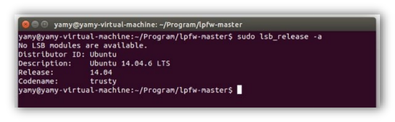 |

The software runs under the Ubuntu 14.04.6 LTS version, and the download Path of the system installation file is: https://releases.ubuntu.com/14.04/ubuntu-14.04.6-desktop-amd64.iso

##### **we chose to implement this software in this system for the following three reasons:**

• In Linux earlier version of Netfilter interface is relatively simple API interface is relatively simple, and the development time of this project is relatively tight.

In higher versions of Ubuntu, for the sake of system security, some network operations of the software are limited, which makes the implementation of the firewall more complicated, and the libnetfilter_conntrack we use requires the system to have the following operating environment:

libnetfilter_conntrack requires libnfnetlink and a kernel that includes the nfnetlink_conntrack subsystem (initial support >= 2.6.14, recommended >= 2.6.18)

nfnetlink_conntrack subsystem is better supported on Ubuntu 14.

Because the course design requires us to design with reference to Windows Firewall, and a prominent feature of Windows Firewall is: when the firewall intercepts unknown Traffic, a pop-up window will let the user decide to block or allow

Finally, we found that this can be achieved using Ubuntu 14's NFQUEUE, which is not high performance because it needs to send network packets to the user program. However, compared to stacking iptables rules, NFQUEUE is more flexible. For new technologies with the same flexibility such as XDP, xt_bpf, etc., NFQUEUE has a wider scope and can be adapted to many old systems.

For the above reasons, we chose Ubuntu 14 as the operating system for development.

in virtual machine Install operating system 

Considering that you may not have Linux operating system installed, here is how to install the Ubuntu 14.04.6 LTS operating system in the VMware virtual machine Ubuntu 14.04.6 LTS operating system in the VMware virtual machine software.

#### Install VMware

The VMware installation package is provided on the genuine software platform of Tongji University, you can follow the following tutorial to install the software: https://blog.csdn.net/qq_40950957/article/details/80467513

#### Install Ubuntu 14.04.6 LTS

|      |                          |
| ---- | ------------------------ |
|      | 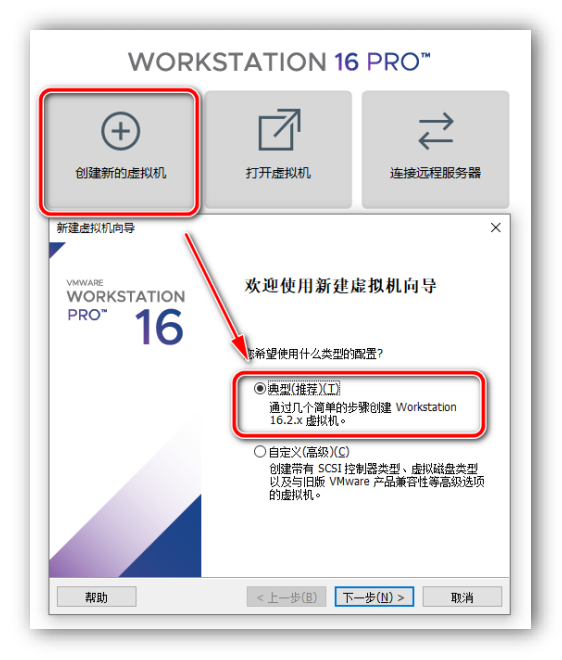 |

You can install Ubuntu 14 system in VMware through a few simple steps, and the download Path of the system installation file is: https://releases.ubuntu.com/14.04/ubuntu-14.04.6-desktop-amd64.iso


 


|      |                          |
| ---- | ------------------------ |
|      | 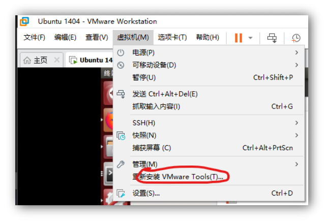 |

After installing the system, install VMware Tools to copy the software installation package directly to the virtual machine machine.

## Install the software

Download the software Compressed Packet submitted by us. Compressed Packet already contains the Compilation binary executable file and decompresses it. At this time, the directory structure of the software is as follows:

E:\FIREWALL-MASTER

├───argtable

[原文] ─ ─ ─ common # third-party library files

BUI ─ ─ ─ GUI # Client software code

─ ─ ─ sha256 #  SHA Encrypt library files

 

## Start the software

The software completed in this experiment consists of two parts: the back end of the firewall and the firewall GUI interface. So we need to start these two parts separately when starting the software:

### Start the firewall backend

Enter the folder where the software code is located, right-click in the blank space to open the end point:

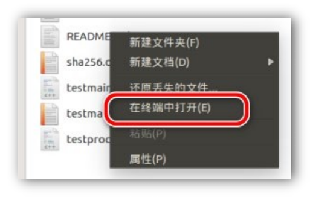

Enter the following command to install dependencies, you may be prompted for an administrator password.

sudo apt-get install make g++ libnetfilter-queue-dev libnetfilter-conntrac k-dev libcap-dev python-qt4

After the installation is complete, enter the following command:

sudo ./lpfw.app

|      |                          |
| ---- | ------------------------ |
|      | 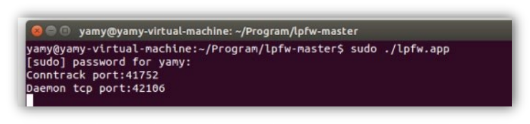 |

Because the firewall requires network traffic interception at the system level, you may be prompted for an administrator password. If the Port Number in the figure above appears, the software backend starts successfully.

### Start the firewall GUI

To create a new end point, enter the following command:

cd gui

sudo python gui.py

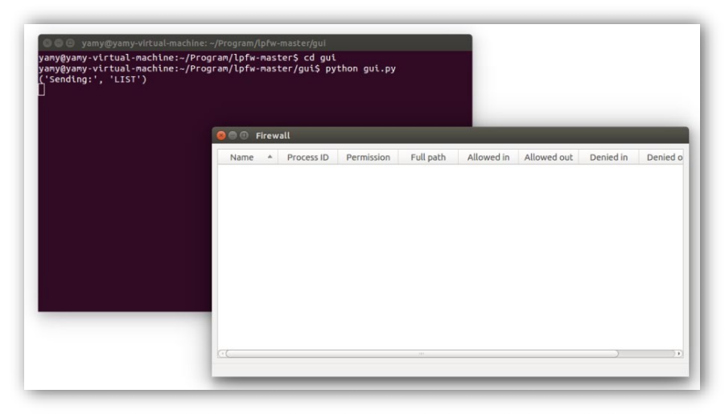

Starting the User Interface does not require administrator privileges, the software interface starts immediately after entering the command.

## use software

## Traffic interception

##### **video presentation:**

|      |                          |
| ---- | ------------------------ |
|      | 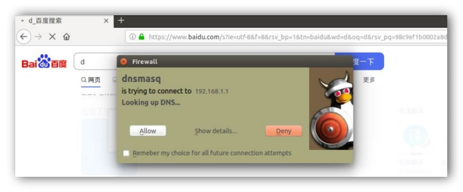 |

https://www.bilibili.com/video/BV1WB4y127rP?share_source=copy_web

After the software starts, it will automatically monitor all network requests in the system. For example, when you open the system's browser, when you open any web page, the firewall will automatically block network requests and pop up the above page. Click Show details to view the connection

|      |                          |
| ---- | ------------------------ |
|      | 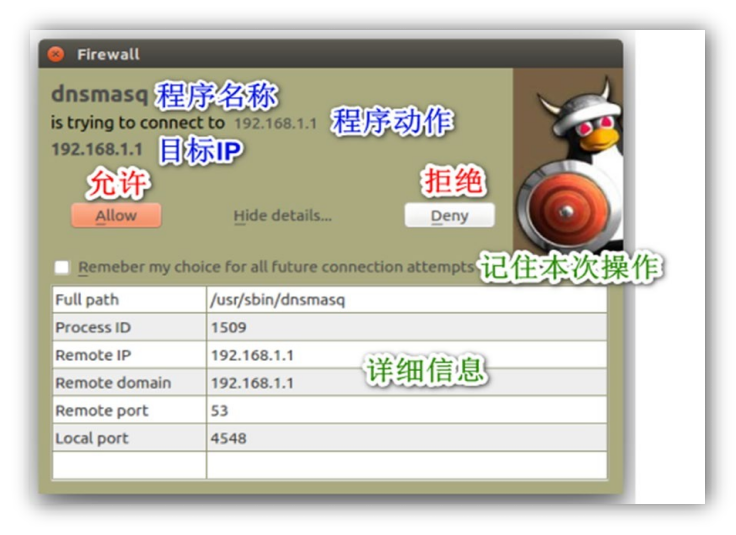 |

Details of the request:

As can be seen in the figure, the firewall automatically obtains the intercepted program name, Path, and operation of the program request (as well as IP and Port Number), which can help the user determine whether the network request should be allowed.

At the same time, there are four kinds of operations that users can perform: allow once, reject once, always allow, and always reject, where always allow and always reject are achieved by checking the Remember option.

## Traffic monitoring

After the user operates on the network request, the program will automatically record relevant information in the User Interface: including program name, process ID, operation type, program Path, and transmission details.

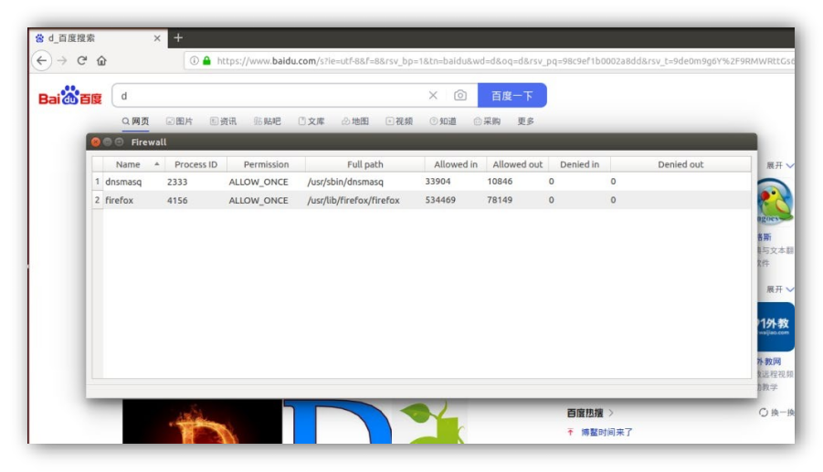

|      |                          |
| ---- | ------------------------ |
|      | 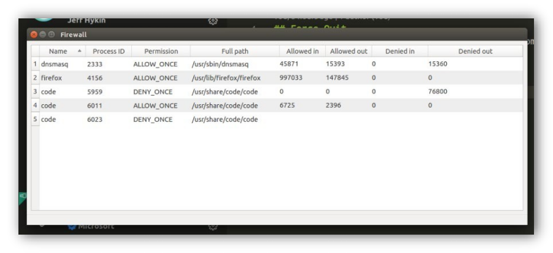 |

The above information will be dynamically updated over time, which is convenient for users to track the status of the link in real time:

### Behavior log

In order to facilitate the user to analyze the behavior of the firewall and avoid misoperation, the software will also automatically record the behavior log of the firewall. The firewall will output the log to the end point by default for general recording. The following is an example of the log:

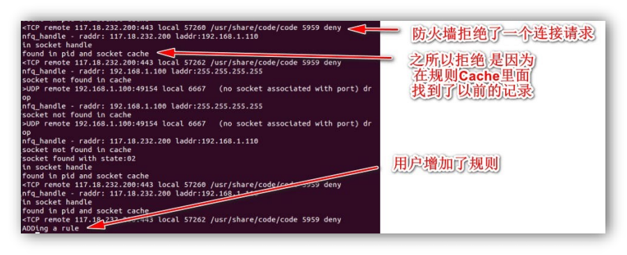

If the user needs to further analyze the firewall log, the following parameters can also be passed in when starting the background:

--logging_facility = file

--Log-info = 1 or 0 (1 on, 0 off)

--log-traffic=        1 或 0

--log-debug        =        1 或 0

|      |                          |
| ---- | ------------------------ |
|      | 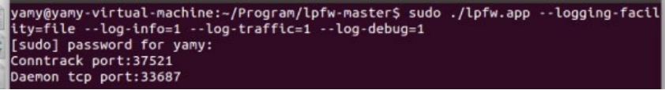 |

The log file is saved in the tmp directory by default. The method of reading the log is as follows:

1. Go to Linux tmp directory

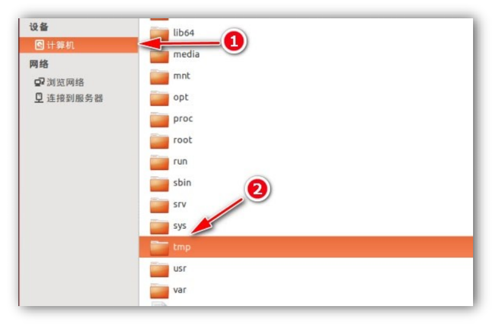

|      |                          |
| ---- | ------------------------ |
|      | 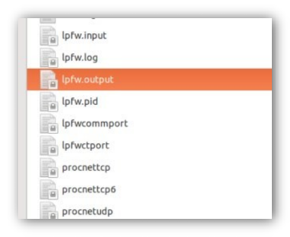 |

You can see all log files saved by the firewall:

### ![ img] (./ pic /wps177.png) Customize default rules

##### **video presentation:**

https://www.bilibili.com/video/BV1xS4y1c7Cs?share_source=copy_web

In order to provide users with greater freedom, in addition to adding rules through pop-up windows, the software can also read user-defined rule files at startup.

1. Go to Linux etc directory

|      |                          |
| ---- | ------------------------ |
|      | 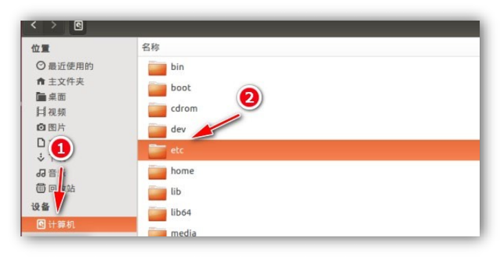 |

2. Find lpfw.rules file

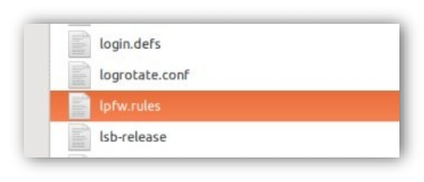

3. In order to edit this file directly, you need to open it with administrator administrator privileges:

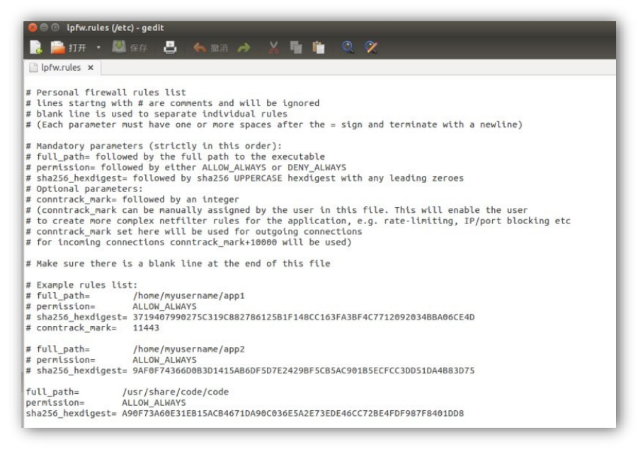

This file contains all the rules for which you have previously selected "Remember My Decision for All future connections", or you can add new rules yourself according to the format in the file. For example:

|      |                          |
| ---- | ------------------------ |
|      | 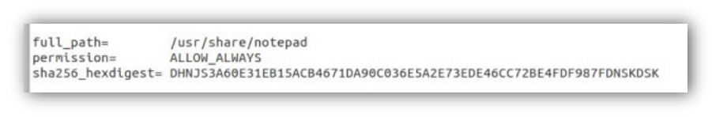 |

### View and add program rules directly GUI View and add program rules directly

|      |                          |
| ---- | ------------------------ |
|      | 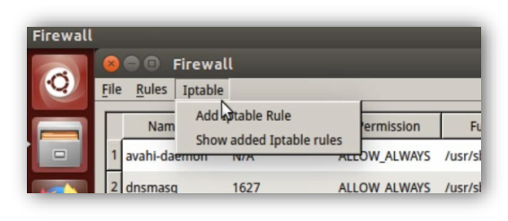 |

In order to further facilitate user customization of rules, we also provide corresponding options in the menu:

Under the Iptable option, you can view all existing rules, or add new custom rules, which is easier than modifying the rules file

• Review existing rules

|      |                          |
| ---- | ------------------------ |
|      | 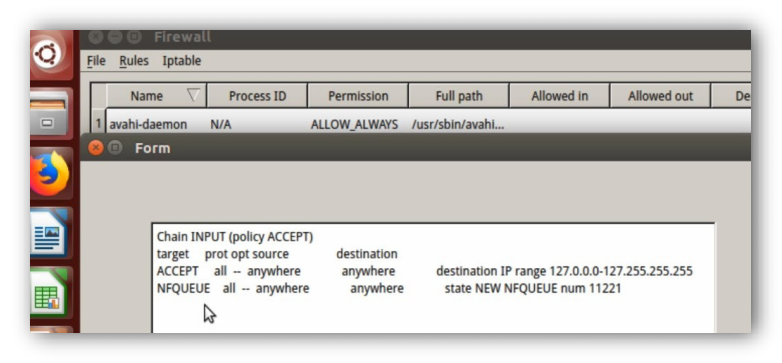 |


• Added custom rules

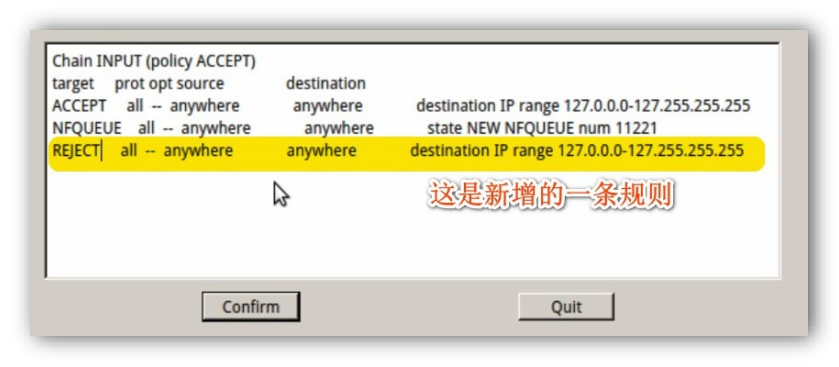

 

 

You can see that with the addition of the REJECT ALL rule, all internet connections are blocked:

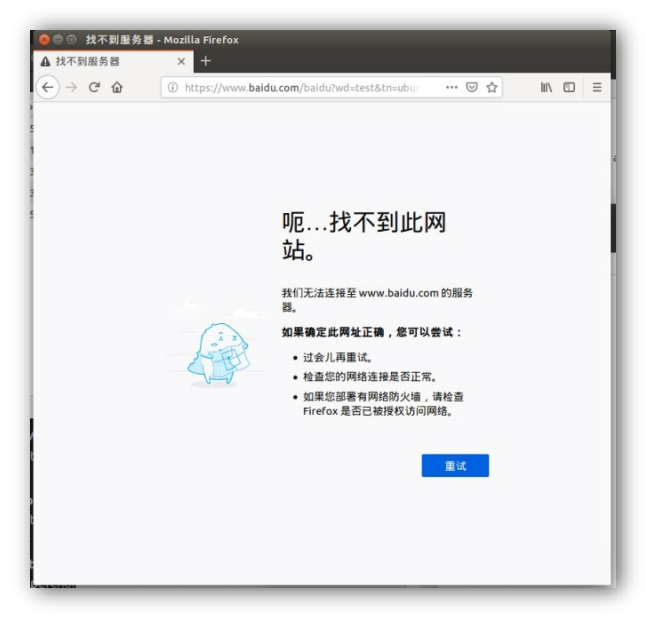

### Delete already added rules

In the upper left menu bar, the Rules tab contains actions that users can perform on rules

|      |                          |
| ---- | ------------------------ |
|      | 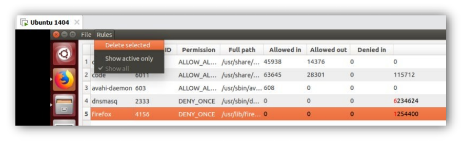 |

To delete a rule, just click to select a rule, then click Delete selected:

|      |                          |
| ---- | ------------------------ |
|      | 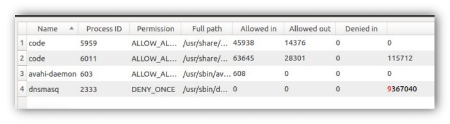 |

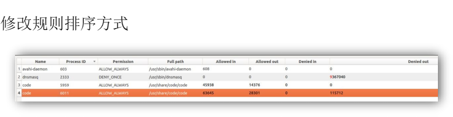

 

 

Users can click on any table header to sort according to the data corresponding to the column, which is convenient for users to filter rules when there is more data.

### Automatically generate rules according to the protocol

##### **video presentation:**

https://www.bilibili.com/video/BV1SS4y1A79s?spm_id_from=333.999.0.0


|      |                          |
| ---- | ------------------------ |
|      | 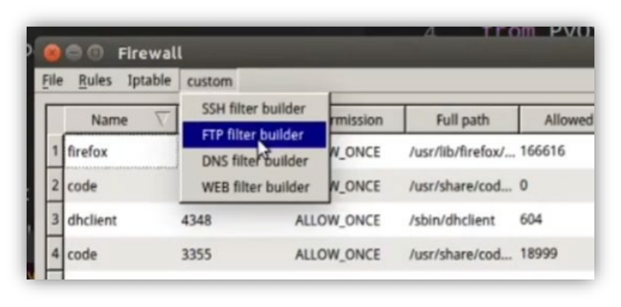 |

The firewall can also automatically generate corresponding iptable rules according to the characteristics of the protocol, which is convenient for users to carry out advanced configuration. The currently adapted network protocols include SSH protocol, FTP protocol, DNS protocol and Web connection.

Users click on the type of rule they want to specify, fill in the corresponding fields, and the software can automatically generate interception rules:

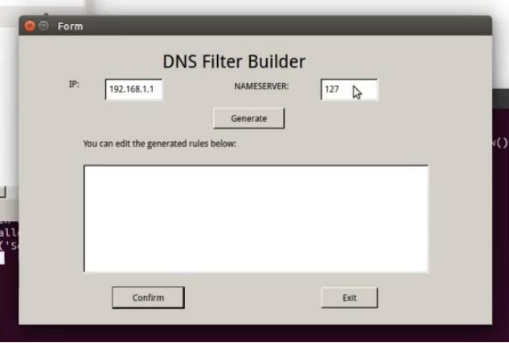 


|      |                          |
| ---- | ------------------------ |
|      | 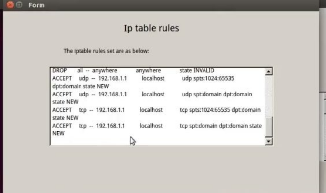 |

Users can check or modify the generated code by themselves. After confirming that the rules are correct, click Confirm.

Compilation software from source code

If you need to recompile the software, the submitted code contains the software's Makefile file, just open end point in the software directory and run the following command:

make clean make lpfw

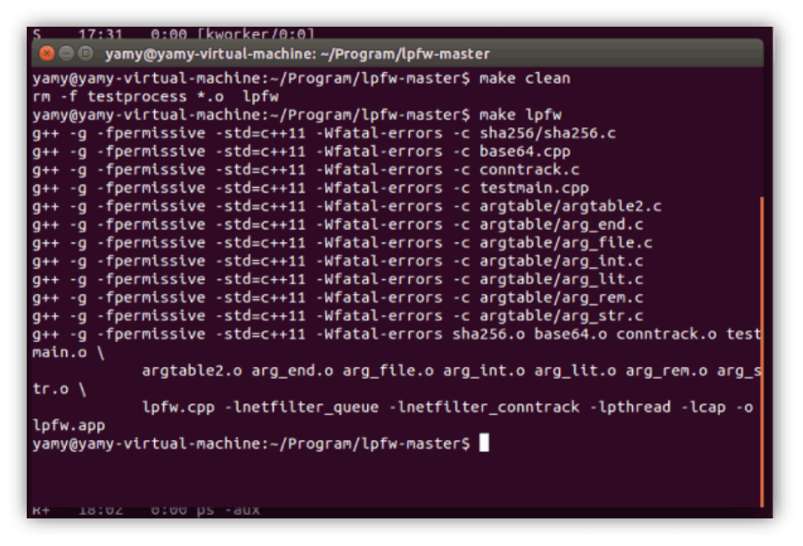

|      |                          |
| ---- | ------------------------ |
|      | 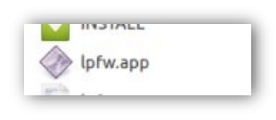 |

After waiting for the Compilation to succeed, the executable file appears in the software root directory as shown in the following figure:

## Troubleshooting

Some common usage issues are listed below:

### software crash

If the software is unresponsive or crashes for some reason, you can follow the steps below to restart the firewall:

1. Open end point

2. Enter the following command

```shell
grep lpfw
```

This is to list all running Firewall instances, we need to focus on the file Path which stores the Path for the firewall program

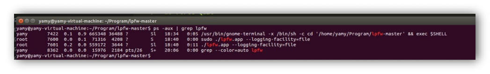 

3. Next, you can run the following command to kill the crashed or unresponsive firewall process: Replace [pid] with the PID just queried

sudo kill -9 [PID]

|      |                          |
| ---- | ------------------------ |
|      | 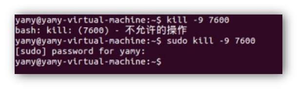 |

You may be asked for an administrator password.

4. Finally, we have to clear the iptables rules added by the firewall to restore normal network connection

```shell
sudo iptables -F
```

### GUI No program display

1. This situation is usually due to the firewall daemon does not exit normally, at this time if the user has created a new firewall process, GUI The program will not know which background to communicate with, so it will not show the network connection.

2. The solution to the problem is also very simple: close all running firewall processes, and GUI Client, restart the program. (Please start the background program first, and then start GUI Client)

## Change Log

•**2022-4-6:V0.10** Implement basic functions

•**2022-4-12:V0.11** Improve the manual about environment configuration content

•**2022-4-13:V0.20 **Add program traffic real-time monitoring function

•**2022-4-16:V0.21 **Added manual failure crash handling scheme

•**2022-4-18:V0.30** Improve the log function

**2022-4-22:V0.40 **Added iptable rule direct query modification function, users can no longer click to enter lpfw.rule

Custom rules can be added directly to the file