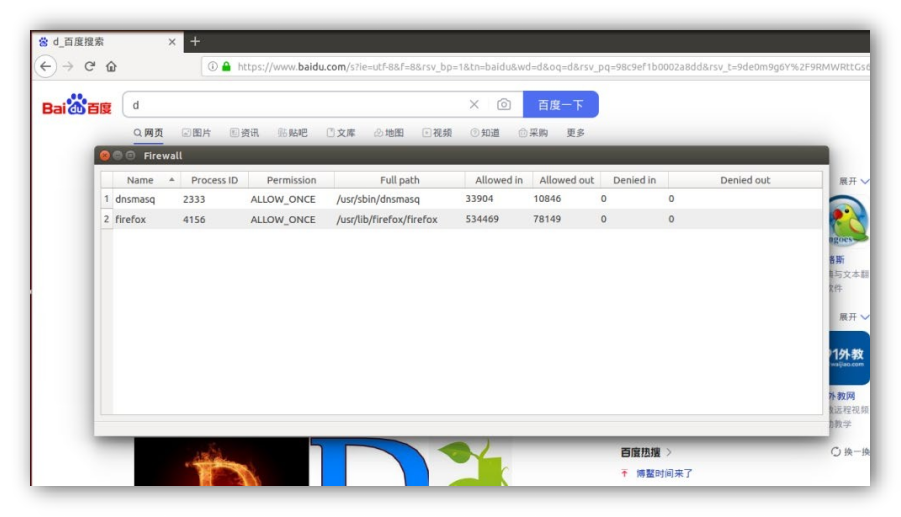
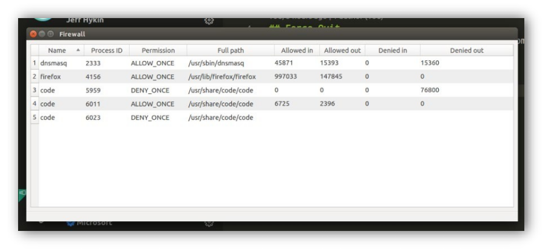
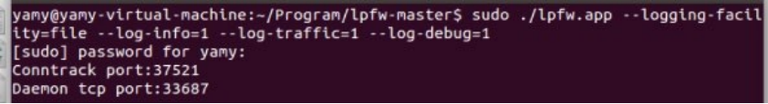
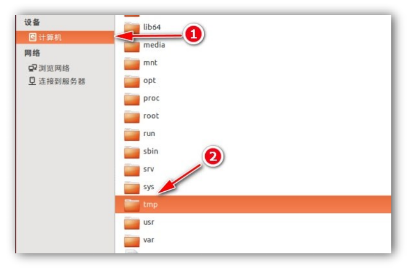
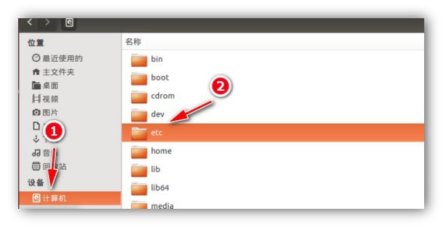
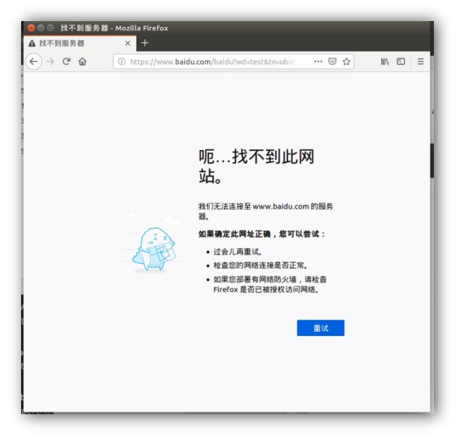
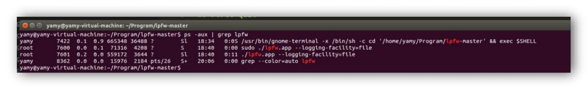
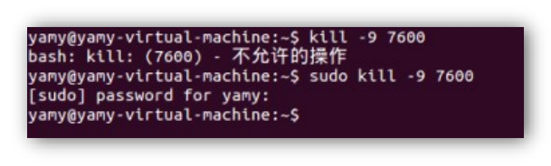

# Linux个人防火墙使用手册

## 视频演示

**为了方便地展示软件的效果, 老师您可以点击下面的连接观看视频演示: 防火墙基础功能**[https://www.bilibili.com/video/BV1WB4y127rP?share_source=copy_web ](https://www.bilibili.com/video/BV1WB4y127rP?share_source=copy_web)**防 火 墙 自 定 义 规 则 :** [https://www.bilibili.com/video/BV1xS4y1c7Cs?share_source=copy_web ](https://www.bilibili.com/video/BV1xS4y1c7Cs?share_source=copy_web)**防 火 墙 高 级 功 能 :** https://www.bilibili.com/video/BV1SS4y1A79s?spm_id_from=333.999.0.0

## 运行环境


|      |                          |
| ---- | ------------------------ |
|      |  |

软件运行于 Ubuntu 系统 14.04.6 LTS 版本下, 系统安装文件的下载路径为: https://releases.ubuntu.com/14.04/ubuntu-14.04.6-desktop-amd64.iso

##### **我们选择在该系统实现本软件有以下三个原因:**

• 在 Linux 早期版本下 Netfilter 的 API 接口较为简单, 而本项目的开发时间较为紧张.

• 在 Ubuntu 更高版本里面, 出于对系统安全性的考虑, 限制了软件的部分网络操作, 使得防火墙的实现更加复杂, 而且我们使用的 libnetfilter_conntrack 要求系统有如下运行环境:

libnetfilter_conntrack requires libnfnetlink and a kernel that includes the nfnetlink_conntrack subsystem (initial support >= 2.6.14, recommended >= 2.6.18)

而 nfnetlink_conntrack subsystem 在 Ubuntu14 上的支持更好.

• 因为课程设计要求我们参照 Windows 防火墙进行设计, 而 Windows 防火墙的一个突出的特点是: 当防火墙拦截到未知流量的时候, 会弹出窗口让用户来决定拦截或者允许. 经过研

究后, 我们发现这可以使用 Ubuntu14 的 NFQUEUE 来实现, 而 NFQUEUE 因为需要将网络包发送给用户程序，所以它的性能并不高；但相比于堆叠 iptables 规则，NFQUEUE 的处理方式更加灵活。而对于 XDP、xt_bpf 等拥有同等灵活性的新技术而言，NFQUEUE 的适用范围更广、能够适配很多老旧系统。

综合以上原因, 我们选择了 Ubuntu14 作为开发的操作系统.

在虚拟机中安装操作系统

考虑到用户您可能没有安装 Linux 操作系统, 下面我们讲解怎样在 VMware 虚拟机软件中安装Ubuntu14.04.6 LTS 操作系统. 如果您已经安装了 VMware 虚拟机软件或者已经安装好了Ubuntu14.04.6 LTS, 请跳过以下步骤.

#### 安装 VMware

在同济大学正版软件平台上提供了 VMware 的安装包, 您可以按照以下教程来安装软件: https://blog.csdn.net/qq_40950957/article/details/80467513

#### 安装 Ubuntu 14.04.6 LTS

|      |                          |
| ---- | ------------------------ |
|      |  |

您可以在 VMware 里面通过简单的几步来安装 Ubuntu14 系统, 系统安装文件的下载路径为: https://releases.ubuntu.com/14.04/ubuntu-14.04.6-desktop-amd64.iso


 


|      |                          |
| ---- | ------------------------ |
|      |  |

在安装好系统以后, 再安装 VMware Tools 便可以将软件安装包直接复制到虚拟机中.

## 安装软件

下载我们提交的软件压缩包, 压缩包里面已经包含编译好的二进制可执行文件, 解压即可. 此时软件的目录结构如下:

E:\FIREWALL-MASTER

├───argtable

├───common	#第三方库文件

├───gui	#Client 端软件代码

└───sha256	#SHA 加密库文件

 

## 启动软件

本次实验完成的软件由两部分组成: 防火墙后端与防火墙 GUI 界面. 所以在启动软件的时候我们需要分别启动这两个部分:

### 启动防火墙后端

进入软件代码所在文件夹, 在空白处右键打开终端:


输入以下命令以安装依赖, 系统可能会提示您输入管理员密码.

sudo apt-get install make g++ libnetfilter-queue-dev libnetfilter-conntrac k-dev libcap-dev python-qt4

在安装完成后输入以下命令:

sudo ./lpfw.app

|      |                          |
| ---- | ------------------------ |
|      |  |

因为防火墙需要在系统层面进行网络流量拦截, 所以系统可能会提示您输入管理员密码. 如果出现上图中的端口号说明软件后端启动成功.

### 启动防火墙 GUI

新建一个终端, 输入以下命令:

cd gui

sudo python gui.py


启动用户界面不需要管理员权限, 输入命令后软件界面随即启动.

## 使用软件

### 流量拦截

##### **视频演示:**

|      |                          |
| ---- | ------------------------ |
|      |  |

https://www.bilibili.com/video/BV1WB4y127rP?share_source=copy_web

软件启动之后,便会自动监控系统里面的所有网络请求. 例如, 当您打开系统的浏览器, 在开启任意网页的时候防火墙便会自动拦截网络请求, 并且弹出以上页面. 点击 Show details 可以查看连

|      |                          |
| ---- | ------------------------ |
|      |  |

接请求的详细信息:

在图中可以看到, 防火墙自动获取了此次拦截的程序名称, 路径, 程序请求的操作(以及 IP 与端口号), 这些信息都可以帮助用户判断是否应该允许此次网络请求.

同时, 用户能够进行的操作有四种: 允许一次, 拒绝一次, 始终允许, 始终拒绝, 其中始终允许和始终拒绝通过勾选 Remember 选择项来实现.

### 流量监控

在用户对联网请求进行操作之后, 程序会在用户界面里面自动记录相关信息: 包括程序名称, 进程 ID, 操作类型, 程序路径, 传输详情.



|      |                          |
| ---- | ------------------------ |
|      |  |

以上信息会随着时间的推移动态更新, 便于用户实时跟踪链接的状态:

### 行为日志

为了便于用户分析防火墙的行为, 避免误操作, 软件还会自动记录防火墙的行为日志. 防火墙默认将日志输出到终端, 用于一般记录, 下面是日志的一个例子:


如果用户需要对防火墙日志进行更进一步的分析, 还可以在启动后台的时候传入以下参数:

--logging_facility = file

--log-info	=	1 或 0 (1 代表开启, 0 代表关闭)

--log-traffic=	1 或 0

--log-debug	=	1 或 0

|      |                          |
| ---- | ------------------------ |
|      |  |

日志文件默认保存在 tmp 目录下. 读取日志的方法如下:

1.	进入 Linux tmp 目录



|      |                          |
| ---- | ------------------------ |
|      |  |

即可看到防火墙保存的所有日志文件:

### 自定义默认规则

##### **视频演示:**

https://www.bilibili.com/video/BV1xS4y1c7Cs?share_source=copy_web

为了给用户提供更大的自由性, 软件除了可以通过弹窗来添加规则, 还能够在启动时读取用户自定义的规则文件.

1. 进入 Linux etc 目录

|      |                          |
| ---- | ------------------------ |
|      |  |

2. 找到 lpfw.rules 文件


3. 为了直接编辑这个文件, 您需要使用管理员权限打开它:


4. 这个文件包括了所有您之前选择了“Remember My Decision for All future connections”的规则, 您也可以按照文件里面的格式来自己添加新的规则. 例如:

|      |                          |
| ---- | ------------------------ |
|      |  |

### 在 GUI 直接查看和新增程序规则

|      |                          |
| ---- | ------------------------ |
|      |  |

为了进一步方便用户进行规则的自定义, 我们还在菜单中提供了对应的选项:

在 Iptable 选项下, 您可以查看现有的所有规则, 或者添加新的自定义规则, 相比修改 rules 文件, 这个方法更加简单

• 查看现有规则

|      |                          |
| ---- | ------------------------ |
|      |  |


• 新增自定义规则


 

 

• 可以看到在新增了 REJECT ALL 规则后, 所有的互联网连接都被阻断了:



### 删除已经添加的规则

在左上角的菜单栏里面, Rules 选项栏包含了用户可以对规则进行的操作

|      |                          |
| ---- | ------------------------ |
|      |  |

要删除一条规则, 只需要先单击选中一条规则, 然后点击 Delete selected 即可:

|      |                          |
| ---- | ------------------------ |
|      |  |


 

 

用户单击任意一个表头即可按照该列对应的数据进行排序, 这便于用户在数据较多的时候进行规则筛选.

### 根据协议自动生成规则

##### **视频演示:**

https://www.bilibili.com/video/BV1SS4y1A79s?spm_id_from=333.999.0.0


|      |                          |
| ---- | ------------------------ |
|      |  |

防火墙还可以根据协议特点, 自动生成相应的 iptable 规则, 方便用户进行高级配置. 目前适配的网络协议有 SSH 协议, FTP 协议,DNS 协议与 Web 连接.

用户点击想要指定的规则类型, 填写相应的字段, 软件便能够自动生成拦截规则:

 


|      |                          |
| ---- | ------------------------ |
|      |  |

用户可以自行检查或者修改生成的代码, 在确认规则无误后, 点击 Confirm 即可.

## 从源代码编译软件

如果需要重新编译软件, 提交的代码含软件的 Makefile 文件, 只需要在软件目录下开启终端, 运行以下命令即可:

make clean make lpfw


|      |                          |
| ---- | ------------------------ |
|      |  |

等待编译成功后, 软件根目录下出现可执行文件如下图所示:

## 故障排除

下面列出了一些常见的使用问题:

### 软件崩溃

如果因为某些原因软件无响应或者崩溃, 可以按照以下步骤来重启防火墙:

1. 打开终端

2. 输入以下命令

```shell
ps -aux | grep lpfw
```

这是为了列出所有运行的 Firewall 实例, 我们需要关注的是文件路径为防火墙程序存储路径的进程

 

3. 接下来可以运行以下命令来杀死崩溃或者无响应的防火墙进程: 将[pid]替换为刚刚查询到的 PID

sudo kill -9 [PID]

|      |                          |
| ---- | ------------------------ |
|      |  |

系统可能会要求您输入管理员密码.

4. 最后我们还要清除防火墙添加的 iptables 规则, 恢复正常的网络连接

```shell
sudo iptables -F
```

### GUI 界面没有程序显示

1. 出现这种情况通常是由于防火墙后台程序没有正常退出, 此时如果用户又新建了一个防火墙进程, GUI 程序将不知道和哪个后台进行通讯, 因而不会显示网络连接.

2. 解决问题的方法也很简单: 关闭所有正在运行的防火墙进程, 与 GUI 客户端, 重新启动程序即可. (请先启动后台程序, 再启动 GUI 客户端)

## Change Log

• **2022-4-6:** **V0.10** 实现基础功能

• **2022-4-12:** **V0.11** 完善手册关于环境配置内容

• **2022-4-13:** **V0.20** 增加程序流量实时监控功能

• **2022-4-16:** **V0.21** 增加手册故障崩溃处理方案

• **2022-4-18:** **V0.30** 完善日志功能

• **2022-4-22:** **V0.40** 增加 iptable 规则直接查询修改功能, 用户可以不用再点击进入 lpfw.rule

文件即可直接增添自定义规则